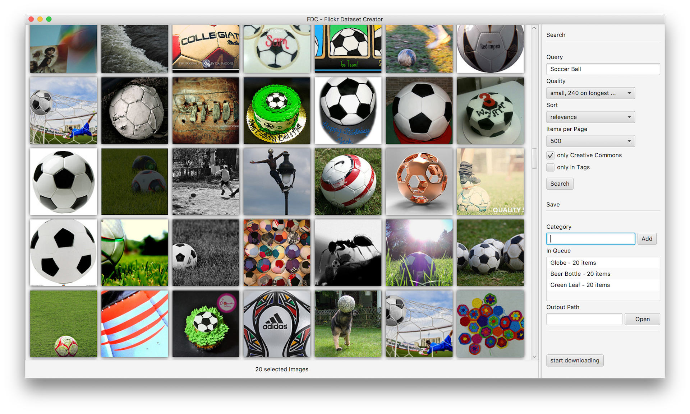

# Flickr-Dataset-Creator

This tool is a UI for the Flickr image search. The target of this
 application is to select images and categorize them manually to create
 custom datasets for Machine Learning or CBIR.

With this application you can select multiple images, collect them to a
category and download this images to a given path in a selected image size.

  